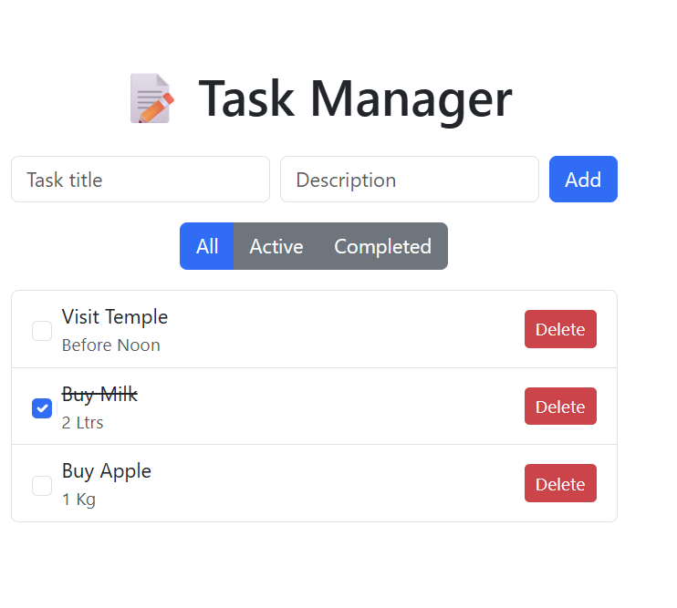

# Task Manager Application

A full-stack task management web application built with .NET 8.0 and React. This application provides a clean, intuitive interface for managing tasks with full CRUD operations, filtering capabilities, and persistent storage both on the server and client side.

---

## Run Instructions

### 1. Backend Configuration

#### Navigate to Backend Directory (TaskApi)
```bash
cd TaskApi
```

#### Restore Dependencies & Run
```bash
dotnet restore
dotnet run
```

The API server will start at:
```
http://localhost:5026
```

#### Verify Backend is Running
```bash
curl http://localhost:5026/api/tasks
```

Expected response: `[]` (empty array if no tasks exist)

### 2. Frontend Configuration 

#### Open New Terminal Window

#### Navigate to Frontend Directory (task-client)
```bash
cd task-client
```

#### Install Dependencies
```bash
npm install
```

#### Start Development Server
```bash
npm run dev
```

The frontend application will start at:
```
http://localhost:5173
```

## Images 





## Features

- **Create, Read, Update, Delete (CRUD)** — Full task management capabilities
- **Task Filtering** — View all tasks, active tasks, or completed tasks
- **Dual Persistence** — Tasks stored in both backend (in-memory) and frontend (localStorage)
- **RESTful API** — Clean API architecture with proper HTTP methods
- **Modern UI** — Responsive React-based interface with theme responsive background.

---

## Technology Stack

### Backend
- .NET 8.0
- ASP.NET Core Web API
- In-memory data storage

### Frontend
- React 18+
- Vite (build tool)
- Modern JavaScript (ES6+)
- tailwind
---

## Prerequisites

Before running this application, ensure you have the following installed:

- [.NET SDK 8.0](https://dotnet.microsoft.com/download) or later
- [Node.js 18+](https://nodejs.org/) and npm
- Git (for cloning the repository)

### Data Flow

1. User interacts with the React frontend
2. Frontend makes HTTP requests to the .NET backend API
3. Backend processes requests and updates in-memory storage
4. Response sent back to frontend
5. Frontend updates UI and syncs with localStorage
---

## Troubleshooting

### CORS Issues

**Symptom:** Frontend cannot connect to backend; console shows CORS errors

**Solution:** 
- Verify backend server is running on `http://localhost:5026`
- Check that CORS is properly configured in `Program.cs`
- Ensure no browser extensions are blocking requests

### Port Conflicts

**Symptom:** Server fails to start due to port already in use

**Solution:**

**Backend:**
- Edit `backend/Properties/launchSettings.json`
- Change the port number in the `applicationUrl` field

**Frontend:**
- Edit `frontend/vite.config.js`
- Add or modify the `server.port` configuration

### Module Not Found Errors

**Symptom:** Frontend fails to start with dependency errors

**Solution:**
```bash
cd task-client
rm -rf node_modules package-lock.json
npm install
```

### .NET SDK Not Found

**Symptom:** `dotnet` command not recognized

**Solution:**
- Download and install .NET SDK 8.0 from [Microsoft's official site](https://dotnet.microsoft.com/download)
- Restart your terminal after installation

---

## Development Notes

- **In-Memory Storage:** Backend uses in-memory storage. Data will be lost when the server restarts.
- **localStorage:** Frontend caches tasks in browser localStorage for improved UX.
- **Hot Reload:** Both frontend and backend support hot reload during development.

---

## Contributing

Contributions are welcome! Please follow these steps:

1. Fork the repository
2. Create a feature branch (`git checkout -b feature/AmazingFeature`)
3. Commit your changes (`git commit -m 'Add some AmazingFeature'`)
4. Push to the branch (`git push origin feature/AmazingFeature`)
5. Open a Pull Request

---