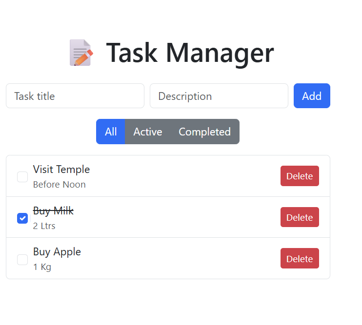
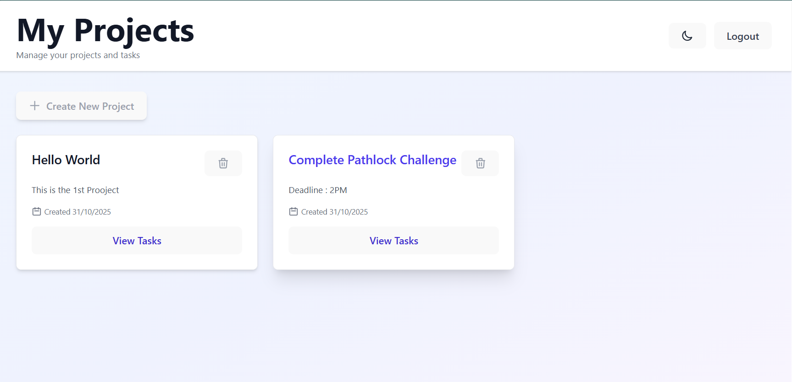

# Pathlock Competition Projects

This repository contains multiple projects developed for the Pathlock Coding Competition.  
Each project is placed in a separate folder with independent setup instructions and dependencies.

---

## Run Instructions
1. Download / Clone the Repo. 
- Locate the dsired folder.
- git clone https://github.com/VikingForcee/Pathlock-Assignment.git
2. Open Problem1_Basic Task Manager and follow README in folder to run Project 1.
- cd Problem1_Basic Task Manager
- code .

(Continue to README inside Problem1_Basic Task Manager)

To run the 2nd Project:
3. Open Problem2_MiniProjectManager and follow the README in folder to run Project 2.
- cd Problem2_MiniProjectManager
- code .

(Continue to README inside Problem2_MiniProjectManager)

## Project 1 — Task Manager Application

A full-stack task management web application built with:

- Backend: .NET 9 Web API (In-Memory Repository)
- Frontend: React + TypeScript + Vite + Bootstrap

### Key Features
- Add, delete, and toggle tasks
- Filter tasks (All, Active, Completed)
- Data persistence through backend and local storage
- Simple, responsive design using Bootstrap

## Project 2 - Mini Project Manager  
_A Full-Stack Web Application for Managing Projects and Tasks_

## Overview

The **Mini Project Manager** is a full-stack web application built using **.NET 8 (C#)** for the backend and **React + TypeScript (Vite)** for the frontend.  
It allows users to register, log in securely using JWT authentication, and manage multiple projects — each containing multiple tasks.

This project fulfills the requirements of **Home Assignment 2** by implementing authentication, relational entities, routing, and complete CRUD functionality. Also implemented Smart Schedule with Time based management.

---

## Features

### Authentication
- User registration & login via JWT tokens  
- Only logged-in users can access their data (projects/tasks)  
- Secure password hashing  

### Projects
- Create, view, and delete projects  
- Each project includes:
  - Title (3–100 chars, required)
  - Description (optional, ≤ 500 chars)
  - Creation date (auto-generated)
- Login/Register 
- Smart Schedule based on Time

### Frontend (React + TypeScript)
- Login/Register forms  
- Dashboard with list of user projects  
- Project details page with all tasks  
- JWT stored in browser and reused for authenticated API calls  
- React Router for page navigation